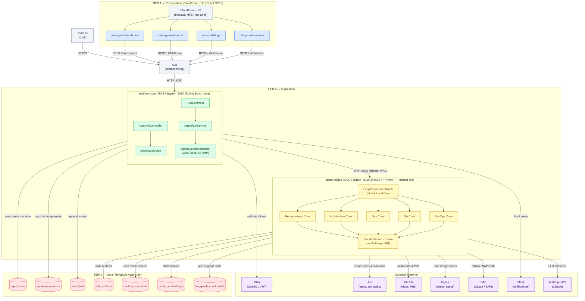

# Platform Overview — Agentic AI SDLC Platform

This diagram provides a full 3-tier view of the Agentic AI SDLC Platform. The **Presentation tier** delivers four React micro-frontends via CloudFront and S3. The **Application tier** is split into two services: `platform-core` (Spring Boot, Java) handles orchestration, approvals, and real-time WebSocket streaming, while `agent-engine` (FastAPI, Python) runs the LangGraph state machine and five CrewAI agent crews. The **Data tier** is a single MongoDB Atlas M30 cluster whose collections cover run state, approvals, audit trails, SDLC artifacts, and LangGraph checkpoints. External integrations — Okta, Jira, GitHub, Figma, SAP, Slack, and Anthropic — are shown on the right with labeled connections to the service that owns each integration.

