# LangGraph SDLC Workflow — Interrupt / Resume State Machine

## How the workflow operates

Every SDLC run executes as a **LangGraph `StateGraph`** hosted inside the `agent-engine` FastAPI service. LangGraph persists a complete snapshot of the workflow state to **MongoDB Atlas** (`langgraph_checkpoints` collection) after every node completes. This makes the graph fully resumable — if the container restarts mid-run, the workflow picks up from the last checkpoint without losing any work.

**Interrupt gates** are the mechanism that pauses the graph and waits for a human decision:

1. After `requirements_crew` completes, LangGraph raises an `Interrupt` and halts. The `platform-core` Spring Boot service detects the `WAITING_APPROVAL` status, persists a record to `approval_requests`, and pushes a real-time notification to the `mfe-approval-portal` via WebSocket STOMP. When a human approves or rejects in the portal, `platform-core` calls the LangGraph resume endpoint with the decision, the checkpoint is loaded, and the graph continues from the exact interrupt point.
2. The same mechanism repeats after `devops_crew` (staging approval before production deploy).

Rejection loops are bounded: requirements can be revised up to 3 times before the run is routed to `error_handler`; QA failures allow a configurable maximum number of re-dev iterations before `qa_failed_handler` terminates the run.

```mermaid
flowchart TD

    %% ─────────────────────────────────────────
    %% NODES
    %% ─────────────────────────────────────────
    START([Run Triggered])

    INTAKE["intake\n─────────────────\nValidates input payload\nFetches enriched context:\n• Jira project metadata\n• SAP system landscape\n• Figma design links\n• Existing GitHub repos\n─────────────────\nReads: agent_runs\nWrites: agent_runs, context_snapshots\n[checkpoint]"]

    REQ["requirements_crew\n─────────────────\nPM Agent + BA Agent + SAP Analyst Agent\n─────────────────\nOutputs:\n• User stories\n• Acceptance criteria\n• SAP dependencies map\n─────────────────\nTools: Jira (create epics), SAP (OData)\nWrites: sdlc_artifacts, audit_trail\n[checkpoint]"]

    REQ_GATE{{"INTERRUPT GATE\nrequirements_approval\n─────────────────\nLangGraph pauses.\nHuman (PM) reviews in\nmfe-approval-portal.\nDecision written to\napproval_requests."}}

    ARCH["architecture_crew\n─────────────────\nSolution Architect Agent + ADR Writer Agent\n─────────────────\nOutputs:\n• OpenAPI specs\n• MongoDB schemas\n• Architecture Decision Records\n• SAP integration plan\n─────────────────\nTools: GitHub (push specs), Figma (read)\nWrites: sdlc_artifacts, audit_trail\n[checkpoint]"]

    DEV["dev_crew\n─────────────────\nJava Dev Agent + React Dev Agent\n+ Tech Lead Agent\n─────────────────\nOutputs:\n• Java Spring Boot services\n• React MFE components\n• Commits + PRs to GitHub\n─────────────────\nTools: GitHub (push code, open PRs)\nWrites: sdlc_artifacts, audit_trail\n[checkpoint]"]

    QA["qa_crew\n─────────────────\nQA Engineer Agent + Security Analyst Agent\n─────────────────\nOutputs:\n• Unit tests\n• Integration tests\n• Security scan report\n─────────────────\nTools: GitHub (push tests)\nWrites: sdlc_artifacts, audit_trail\n[checkpoint]"]

    DEVOPS["devops_crew\n─────────────────\nDevOps Engineer Agent + SRE Agent\n─────────────────\nOutputs:\n• Terraform configs\n• GitHub Actions pipeline\n• Staging deployment\n─────────────────\nTools: GitHub (push IaC, trigger actions)\nWrites: sdlc_artifacts, audit_trail\n[checkpoint]"]

    STAGING_GATE{{"INTERRUPT GATE\nstaging_approval\n─────────────────\nLangGraph pauses.\nHuman reviews staging env.\nDecision written to\napproval_requests."}}

    PROD["deploy_prod\n─────────────────\nDeploys to production environment\nUpdates run status → COMPLETED\nSends Slack success notification\n─────────────────\nWrites: agent_runs, audit_trail"]

    ERR["error_handler\n─────────────────\nMarks run as FAILED\nReason: max requirement\nrejections exceeded\nSends Slack alert\n─────────────────\nWrites: agent_runs, audit_trail"]

    QA_ERR["qa_failed_handler\n─────────────────\nMarks run as FAILED\nReason: max QA iterations\nexceeded\nSends Slack alert\n─────────────────\nWrites: agent_runs, audit_trail"]

    DONE([Run Complete])
    FAIL([Run Failed])

    %% ─────────────────────────────────────────
    %% EDGES — main flow
    %% ─────────────────────────────────────────
    START --> INTAKE
    INTAKE --> REQ
    REQ --> REQ_GATE

    REQ_GATE -->|"approved"| ARCH
    REQ_GATE -->|"rejected\n(attempt < 3)"| REQ
    REQ_GATE -->|"rejected\n(attempt >= 3)\nmax_retries_exceeded"| ERR

    ARCH --> DEV
    DEV --> QA

    QA -->|"passed"| DEVOPS
    QA -->|"failed\n(iteration < max)"| DEV
    QA -->|"failed\n(iteration >= max)\nmax_retries_exceeded"| QA_ERR

    DEVOPS --> STAGING_GATE

    STAGING_GATE -->|"approved"| PROD
    STAGING_GATE -->|"rejected"| DEV

    PROD --> DONE
    ERR --> FAIL
    QA_ERR --> FAIL

    %% ─────────────────────────────────────────
    %% CHECKPOINT ANNOTATION (side note box)
    %% ─────────────────────────────────────────
    NOTE["LangGraph Checkpoint Policy\n─────────────────────────\nAfter EVERY node: full state\nsnapshot written to MongoDB\ncollection: langgraph_checkpoints\n\nEnables:\n• Container restart recovery\n• Human interrupt/resume\n• Full run replay\n• Audit reproducibility"]

    style NOTE fill:#f8fafc,stroke:#94a3b8,stroke-dasharray:5 5,color:#334155

    %% ─────────────────────────────────────────
    %% STYLES
    %% ─────────────────────────────────────────
    classDef node fill:#dcfce7,stroke:#16a34a,color:#14532d,text-align:left
    classDef gate fill:#fef3c7,stroke:#d97706,color:#78350f,font-weight:bold
    classDef errNode fill:#fee2e2,stroke:#dc2626,color:#7f1d1d
    classDef terminal fill:#e0f2fe,stroke:#0284c7,color:#0c4a6e,font-weight:bold

    class INTAKE,REQ,ARCH,DEV,QA,DEVOPS,PROD node
    class REQ_GATE,STAGING_GATE gate
    class ERR,QA_ERR errNode
    class START,DONE,FAIL terminal
```

## MongoDB collections accessed per stage

| Workflow Stage | Collections Read | Collections Written |
|---|---|---|
| `intake` | `agent_runs`, `context_snapshots` | `agent_runs`, `context_snapshots` |
| `requirements_crew` | `context_snapshots`, `vector_embeddings` | `sdlc_artifacts`, `audit_trail`, `langgraph_checkpoints` |
| `requirements_approval` (interrupt) | `approval_requests` | `approval_requests`, `langgraph_checkpoints` |
| `architecture_crew` | `sdlc_artifacts`, `context_snapshots` | `sdlc_artifacts`, `audit_trail`, `langgraph_checkpoints` |
| `dev_crew` | `sdlc_artifacts` | `sdlc_artifacts`, `audit_trail`, `langgraph_checkpoints` |
| `qa_crew` | `sdlc_artifacts` | `sdlc_artifacts`, `audit_trail`, `langgraph_checkpoints` |
| `devops_crew` | `sdlc_artifacts` | `sdlc_artifacts`, `audit_trail`, `langgraph_checkpoints` |
| `staging_approval` (interrupt) | `approval_requests` | `approval_requests`, `langgraph_checkpoints` |
| `deploy_prod` | `agent_runs` | `agent_runs`, `audit_trail` |
| `error_handler` / `qa_failed_handler` | `agent_runs` | `agent_runs`, `audit_trail` |

## External tool usage per crew

| Crew | External Tools Used |
|---|---|
| Requirements Crew | Jira (create epic + sub-tasks), SAP (OData — read system landscape) |
| Architecture Crew | GitHub (push OpenAPI specs + schemas), Figma (read design specs) |
| Dev Crew | GitHub (push commits, open PRs), Jira (update sub-task status) |
| QA Crew | GitHub (push test files, read PR diff) |
| DevOps Crew | GitHub (push Terraform + Actions, trigger workflow runs) |
| deploy_prod | Slack (success notification), Jira (close epic) |
| error_handler / qa_failed_handler | Slack (failure alert) |
