# AWS Infrastructure Diagram

This diagram depicts the full AWS infrastructure for the Agentic AI Platform deployed in `us-east-1`. The VPC (`10.0.0.0/16`) is divided into three subnet tiers: **Public** subnets host the internet-facing ALB and NAT Gateways; **Private** subnets run the ECS Fargate workloads behind security-group chain enforcement; **Isolated** subnets contain data-plane endpoints (MongoDB Atlas PrivateLink, VPC Interface Endpoints) with no direct internet path. GitHub Actions uses OIDC federation to assume an IAM Role for CI/CD deployments to ECR and ECS.

```mermaid
graph TD
    %% ─────────────────────────────────────────
    %% Internet Layer
    %% ─────────────────────────────────────────
    Browser["👤 User Browser"]
    CF["☁️ CloudFront\n(ReactJS MFEs)"]
    S3["🪣 S3 Bucket\n(MFE Static Assets)"]
    R53["🌐 Route 53\n(DNS)"]
    ACM["🔒 ACM\n(TLS Certificate)"]

    Browser -->|"HTTPS"| CF
    Browser -->|"HTTPS"| R53
    CF -->|"origin fetch"| S3
    CF -.->|"TLS cert"| ACM

    %% ─────────────────────────────────────────
    %% AWS Account / us-east-1 VPC 10.0.0.0/16
    %% ─────────────────────────────────────────
    subgraph VPC["🏢 AWS Account — us-east-1  |  VPC 10.0.0.0/16"]

        %% ── Public Subnets ──────────────────
        subgraph PUBLIC["🟢 Public Subnets  (10.0.1.0/24 · 10.0.2.0/24)"]
            IGW["🔌 Internet Gateway"]
            ALB["⚖️ ALB\n(internet-facing)\nports 80 / 443\nsg-alb"]
            NATGW_A["🔀 NAT Gateway A\n(us-east-1a)\nEIP: elastic-ip-a"]
            NATGW_B["🔀 NAT Gateway B\n(us-east-1b)\nEIP: elastic-ip-b"]
        end

        %% ── Private Subnets ─────────────────
        subgraph PRIVATE["🟡 Private Subnets  (10.0.11.0/24 · 10.0.12.0/24)"]
            subgraph SG_PLATFORM["sg-platform-app"]
                PLATFORM["📦 ECS Fargate\nplatform-app (Java)\nport 8080"]
            end
            subgraph SG_AGENT["sg-agent-engine"]
                AGENT["🤖 ECS Fargate\nagent-engine (Python)\nport 8000  |  internal only"]
            end
        end

        %% ── Isolated Subnets ────────────────
        subgraph ISOLATED["🔴 Isolated Subnets  (10.0.21.0/24 · 10.0.22.0/24)"]
            PL_MONGO["🔗 MongoDB Atlas\nPrivateLink Endpoint"]
            VPE_SM["🔐 VPC Interface Endpoint\nSecrets Manager"]
            VPE_ECR["📦 VPC Interface Endpoint\nECR (API + DKR)"]
            VPE_CWL["📊 VPC Interface Endpoint\nCloudWatch Logs"]
            VPE_STS["🪪 VPC Interface Endpoint\nSTS"]
        end

    end

    %% ─────────────────────────────────────────
    %% AWS Managed Services (right side)
    %% ─────────────────────────────────────────
    subgraph AWS_SVC["☁️ AWS Managed Services"]
        ECR["📦 ECR\nplatform-app repo\nagent-engine repo"]
        SM["🔐 Secrets Manager\n7 secrets"]
        CW["📊 CloudWatch\nlog groups · alarms · dashboard"]
        SNS["📣 SNS\nalerts topic"]
        EMAIL["📧 Email"]
        SLACK_ALERT["💬 Slack Alerts"]
    end

    %% ─────────────────────────────────────────
    %% CI/CD
    %% ─────────────────────────────────────────
    subgraph CICD["⚙️ CI/CD"]
        GHA["🐙 GitHub Actions\n(OIDC)"]
        IAM["🪪 IAM Role\necs-deploy-role"]
    end

    %% ─────────────────────────────────────────
    %% External Systems
    %% ─────────────────────────────────────────
    subgraph EXTERNAL["🌍 External Systems"]
        MONGO["🍃 MongoDB Atlas M30\nus-east-1 primary\neu-west-1 DR node"]
        ANTHROPIC["🧠 Anthropic API\n(Claude Sonnet)"]
        OKTA["🔑 Okta\n(OIDC / JWT)"]
        INTEGRATIONS["🔧 Jira · GitHub\nFigma · SAP"]
    end

    %% ─────────────────────────────────────────
    %% Traffic Flows
    %% ─────────────────────────────────────────

    %% Internet → Public
    R53 -->|"DNS → ALB"| ALB
    IGW --> ALB

    %% ALB → platform-app (sg chain: ALB → platform-app)
    ALB -->|"HTTPS :8080\nsg-alb → sg-platform-app"| PLATFORM

    %% platform-app → agent-engine (sg chain: platform-app → agent-engine)
    PLATFORM -->|"HTTP :8000\nsg-platform-app → sg-agent-engine"| AGENT
    AGENT -->|"SSE stream\napproval events"| PLATFORM
    PLATFORM -->|"WebSocket STOMP"| ALB

    %% ECS outbound via NAT Gateways
    PLATFORM -->|"outbound HTTPS\nvia NAT GW"| NATGW_A
    AGENT -->|"outbound HTTPS\nvia NAT GW"| NATGW_B
    NATGW_A --> IGW
    NATGW_B --> IGW

    %% Isolated subnet connections (PrivateLink / VPC Endpoints)
    PLATFORM -->|"PrivateLink"| PL_MONGO
    AGENT -->|"PrivateLink"| PL_MONGO
    PLATFORM -->|"VPC Endpoint"| VPE_SM
    AGENT -->|"VPC Endpoint"| VPE_SM
    PLATFORM -->|"VPC Endpoint"| VPE_CWL
    AGENT -->|"VPC Endpoint"| VPE_CWL
    PLATFORM -->|"VPC Endpoint"| VPE_STS
    AGENT -->|"VPC Endpoint"| VPE_STS

    %% ECR pulls (via VPC endpoint)
    PLATFORM -->|"image pull"| VPE_ECR
    AGENT -->|"image pull"| VPE_ECR
    VPE_ECR --> ECR

    %% Secrets Manager
    VPE_SM --> SM

    %% MongoDB Atlas PrivateLink → Atlas cluster
    PL_MONGO -->|"PrivateLink\nMongoDB Wire Protocol"| MONGO

    %% CloudWatch → SNS → alerts
    VPE_CWL --> CW
    CW -->|"alarm"| SNS
    SNS --> EMAIL
    SNS --> SLACK_ALERT

    %% NAT → External APIs
    IGW -->|"HTTPS"| ANTHROPIC
    IGW -->|"HTTPS"| OKTA
    IGW -->|"HTTPS"| INTEGRATIONS

    %% Okta JWT validation
    PLATFORM -.->|"JWT validation"| OKTA

    %% CI/CD deploy path
    GHA -->|"OIDC federation"| IAM
    IAM -->|"ecr:PutImage"| ECR
    IAM -->|"ecs:UpdateService"| PLATFORM
    IAM -->|"ecs:UpdateService"| AGENT

    %% Styling
    classDef publicStyle fill:#d4edda,stroke:#28a745,color:#000
    classDef privateStyle fill:#fff3cd,stroke:#ffc107,color:#000
    classDef isolatedStyle fill:#f8d7da,stroke:#dc3545,color:#000
    classDef awsSvc fill:#cce5ff,stroke:#004085,color:#000
    classDef external fill:#e2e3e5,stroke:#6c757d,color:#000
    classDef cicd fill:#f3e5f5,stroke:#7b1fa2,color:#000

    class IGW,ALB,NATGW_A,NATGW_B publicStyle
    class PLATFORM,AGENT privateStyle
    class PL_MONGO,VPE_SM,VPE_ECR,VPE_CWL,VPE_STS isolatedStyle
    class ECR,SM,CW,SNS,EMAIL,SLACK_ALERT,S3,CF,R53,ACM awsSvc
    class MONGO,ANTHROPIC,OKTA,INTEGRATIONS external
    class GHA,IAM cicd
```

