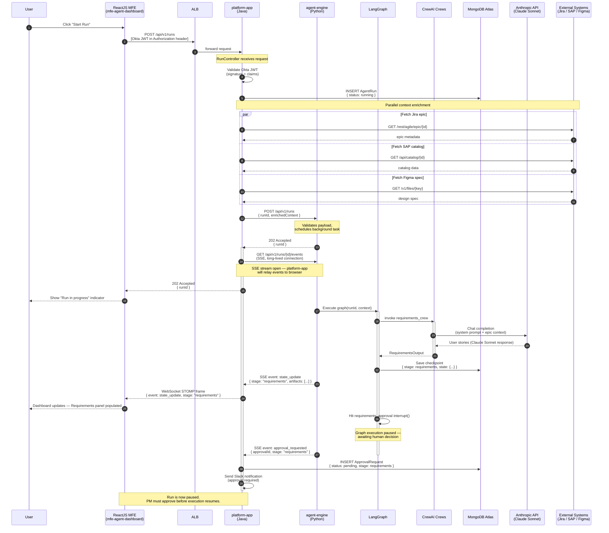
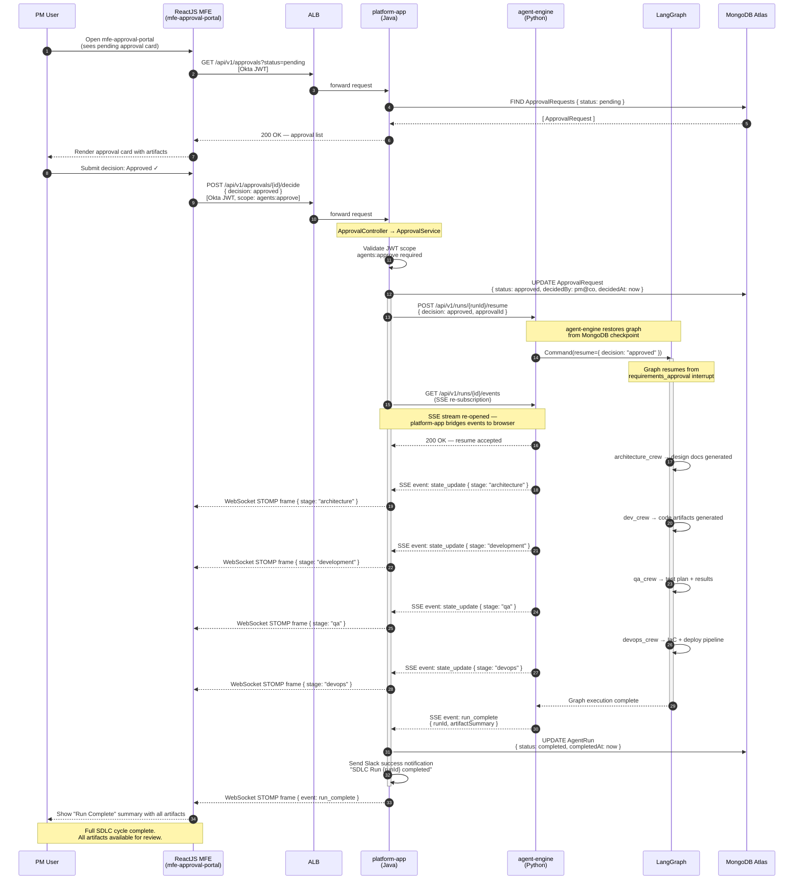

# Data Flow Diagrams

These sequence diagrams trace the two principal runtime flows of the Agentic AI Platform: initiating a full SDLC automation run and resuming that run after a human approval decision. Together they capture the asynchronous, event-driven handoff between the React MFEs, the Java orchestration layer (`platform-app`), the Python agent runtime (`agent-engine`), LangGraph's stateful graph execution, and the external services that feed and are fed by the AI crews.

---

## Flow 1: Start SDLC Run

A user triggers an automated SDLC run from `mfe-agent-dashboard`. The platform-app orchestrates context enrichment, delegates execution to agent-engine, and then bridges the agent-engine SSE event stream back to the browser over WebSocket STOMP. The long-lived SSE connection between platform-app and agent-engine is highlighted with `activate`/`deactivate` blocks.

---

## Flow 2: Human Approval → Resume

A PM reviews the AI-generated requirements artifacts in `mfe-approval-portal` and submits an approval decision. The platform-app persists the decision, instructs agent-engine to resume the LangGraph graph from its saved checkpoint, re-opens the SSE bridge, and the remaining SDLC crews (architecture, dev, QA, DevOps) execute to completion.

